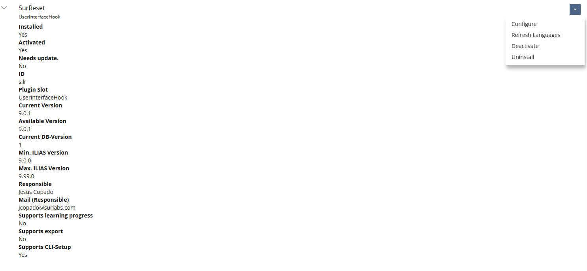
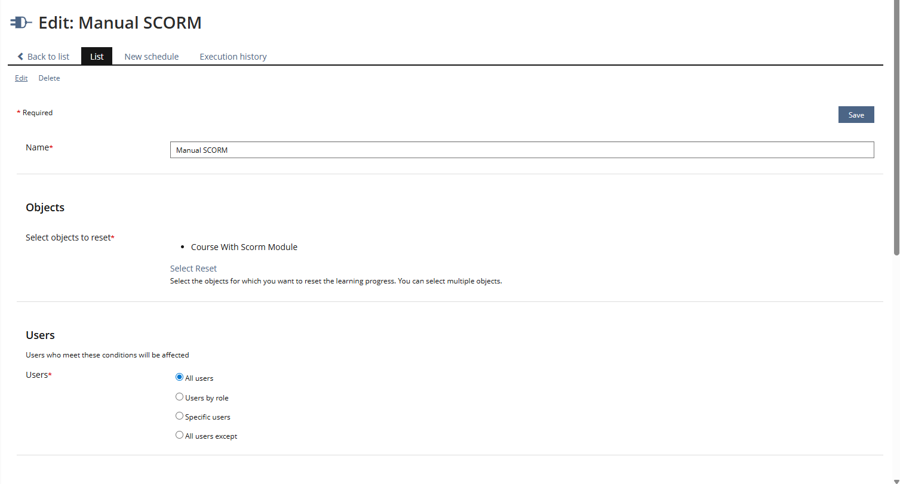
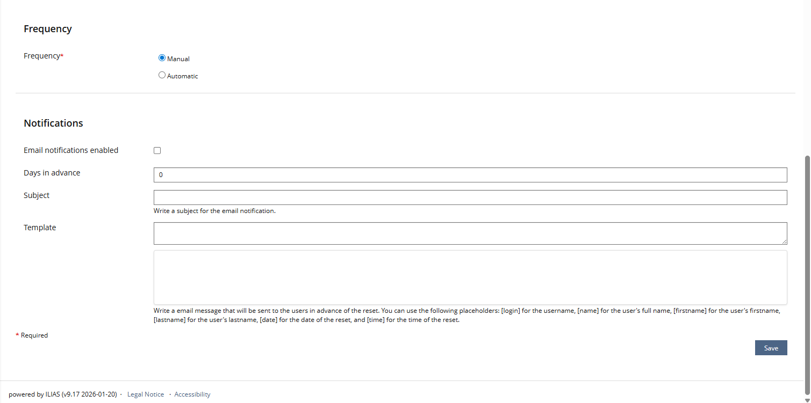
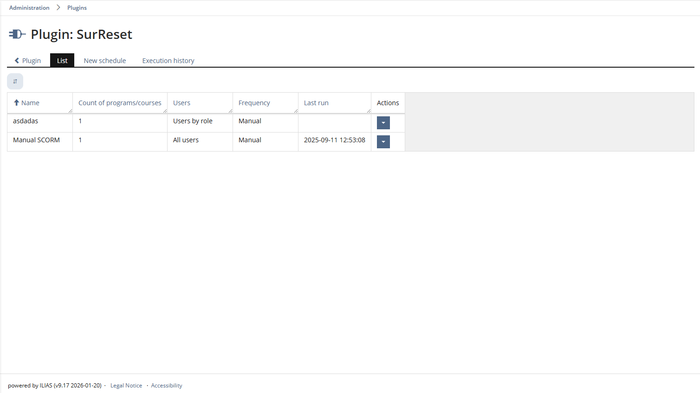
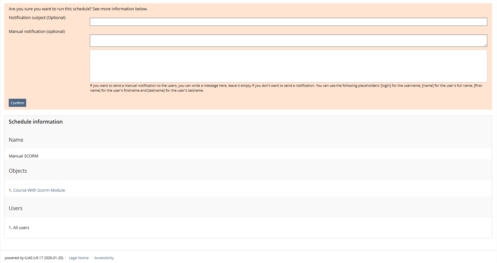
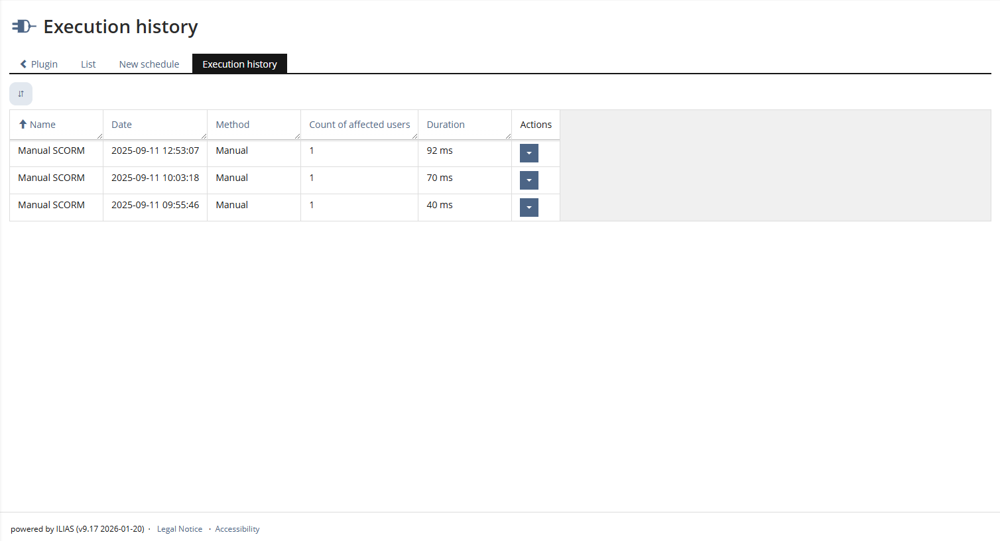

# SurReset User Manual

**Platform:** ILIAS  
**Plugin:** SurReset  

---

## 1. What is SurReset?

SurReset helps you reset learning progress for selected learning areas on a planned schedule.

You can use it to:
- Reset progress manually when needed.
- Set automatic reset schedules.
- Choose who is affected by each reset.
- Check what was executed and when.

---

## 2. Open SurReset Configuration

1. Go to **Administration > Plugins**.
2. Find **SurReset**.
3. Open the plugin configuration page.

*Plugin administration view with SurReset activation controls.*

---

## 3. Activate or Deactivate the Plugin

- Click **Activate** to enable SurReset.
- Click **Deactivate** to disable it.

When active, you can create and run schedules.

---

## 4. Create or Edit a Schedule

### Create

1. Open SurReset.
2. Click **New schedule**.
3. Complete:
- **Name**
- **Objects** (where reset will apply)
- **Users** (who will be affected)
- **Frequency** (manual or automatic)
- Optional **email notification**
4. Save.

*New schedule form (upper section).*

*New schedule form (lower section).*

### Edit

1. Open **List**.
2. Select **Edit** on the schedule.
3. Update and save.

*Schedule list with edit action.*

---

## 5. Run a Schedule Manually

1. In **List**, select **Run**.
2. Confirm execution.
3. Optional: write a notification subject/message.
4. Wait for success message.

*Manual run confirmation view.*

---

## 6. Automatic Execution

Automatic schedules are executed by ILIAS cron.

What this means:
- If frequency is automatic, SurReset checks when to run.
- If notifications are enabled, SurReset can send emails before execution.

If cron is not running, automatic schedules and email notifications will not run.

---

## 7. Confirm Results

1. Open **Execution History**.
2. Check:
- Date
- Method (manual/automatic)
- Affected users
- Duration
3. Open details to see affected objects and users.

*Execution history and result verification view.*

---

## 8. Common Problems

### Schedule did not run automatically
- Check or ask your administrator to verify ILIAS cron status.
- Confirm the schedule is set to automatic frequency.

### Users did not receive notification email
- Check that notifications are enabled.
- Check email subject/template are filled.

### I cannot see execution results
- Refresh **Execution History**.
- Check or ask your administrator to check plugin and cron logs.

---

## 9. Good Practice

- Use clear schedule names.
- Test with a small set of users first.
- Run manual validation before enabling large automatic schedules.
